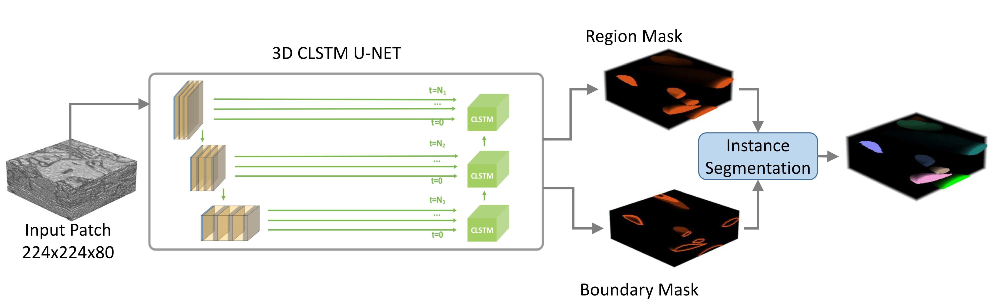
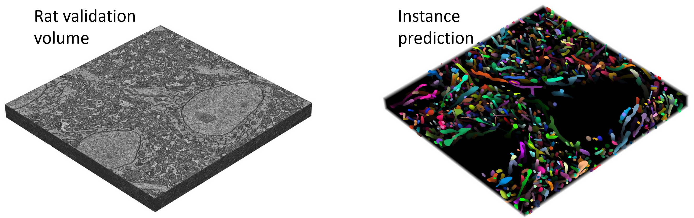

This repository contains the implementation of our paper of 3D Convolutional Long Short Term Memory (CLSTM) network.

```
Nguyen, N. P., White, T., & Bunyak, F. Mitochondria Instance Segmentation in Electron Microscopy Image Volumes using 3D Deep Learning Networks (2021). IEEE/Applied Imagery Pattern Recognition Workshop, AIPR.
```




It relies on the following projects:  
[CFCM-2D](https://github.com/faustomilletari/CFCM-2D)  
[ConvLSTM](https://github.com/rogertrullo/pytorch_convlstm)  
[MONAI](https://github.com/Project-MONAI/MONAI)  
[TorchIO](https://github.com/fepegar/torchio)  
[Segmenation Models Pytorch](https://github.com/qubvel/segmentation_models.pytorch)  
[Connectomics](https://github.com/zudi-lin/pytorch_connectomics)


## Install
```
pip install git+https://github.com/zudi-lin/pytorch_connectomics
```


```

pip install -r requirements.txt
```


## Train
```
python train_mito.py --model --data
```

with  
--model: check point path (default is None)  
--data: data path   


## Test
```
python test_mito.py --model --data
```

with  
--model: check point path  
--data: data path



## References  
The dataset used in this work is downloaded from
```
Wei, D., Lin, Z., Franco-Barranco, D., Wendt, N., Liu, X., Yin, W., Huang, X., Gupta, A., Jang, W. D., Wang, X., Arganda-Carreras, I., Lichtman, J. W., & Pfister, H. (2020). MitoEM Dataset: Large-scale 3D Mitochondria Instance Segmentation from EM Images. Medical image computing and computer-assisted intervention : MICCAI ... International Conference on Medical Image Computing and Computer-Assisted Intervention, 12265, 66–76. https://doi.org/10.1007/978-3-030-59722-1_7
```


